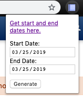

# Schedule Builder to Calendar

Google chrome extension to take your current schedule from schedule builder (UC Davis) and save it a calendar format to be imported into google calendar or any other calendar software.

This extensions assumes PST (since UC Davis is in PST time)

## How to use:
The extension is downloadable on the Google Store [here](https://chrome.google.com/webstore/detail/schedule-to-calendar/cpoahfmojjcbpkeigieneocpefehggjh).

After downloading, go to schedulebuilder for the correct term, and open the extension UI. Type in the correct starting and ending dates for the quarter. Then, simply generate and download the ical file which you can import to the calendar application of your choice (e.g. google calendar).

Note: You must be registered and not waitlisted for the classes you wish to get the schedule for.
